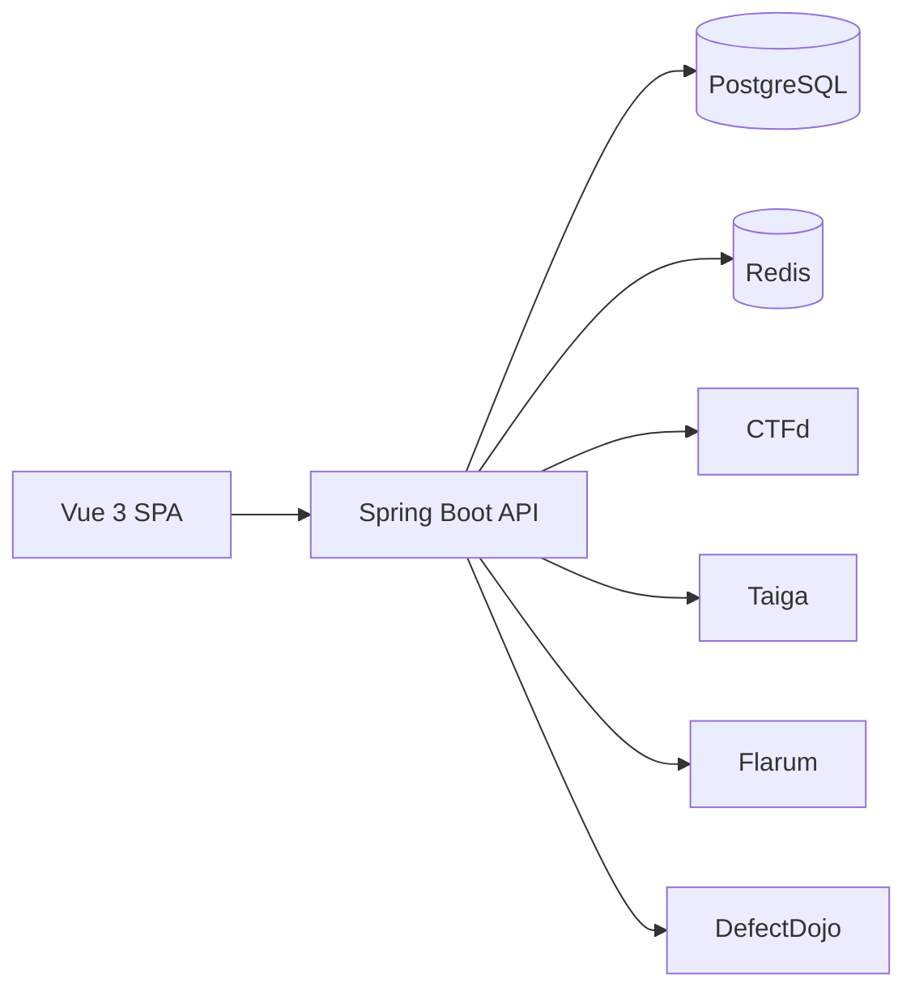

# WhiteHat Hub architecture

## Project layout

```text
whitehat-hub/
|-- backend/                  Spring Boot 3 API
|   |-- src/main/java/com/whitehat/platform/
|   |   |-- common/          response model and errors
|   |   |-- config/          security, JWT and MyBatis config
|   |   |-- controller/      REST endpoints
|   |   |-- domain/          database entities and enums
|   |   |-- dto/             validated request/response contracts
|   |   |-- integration/     CTFd/Taiga/Flarum/DefectDojo adapters
|   |   |-- mapper/          MyBatis Plus mappers
|   |   `-- service/         transactional business rules
|   `-- src/main/resources/  config and Flyway migrations
|-- frontend/                 Vue 3 + TypeScript + Vite SPA
|   `-- src/
|       |-- api/             typed HTTP client
|       |-- components/      reusable UI
|       |-- layouts/         application shell
|       |-- stores/          Pinia auth state
|       `-- views/           dashboard/task/profile/company/community
|-- docs/                     architecture, ER and API contracts
`-- docker-compose.yml        local/Linux deployment
```

## Service boundaries

The first release is a modular monolith. Authentication, white-hat, company,
task, vulnerability and community modules have separate packages and tables,
so high-load modules can later be extracted without changing the public API.
External products are behind HTTP adapters and an outbox-ready sync table.



Security controls include BCrypt credentials, stateless JWT authentication,
role authorization, Bean Validation, MyBatis parameter binding, upload allow
lists, randomized stored filenames, maximum request sizes and audit fields.

