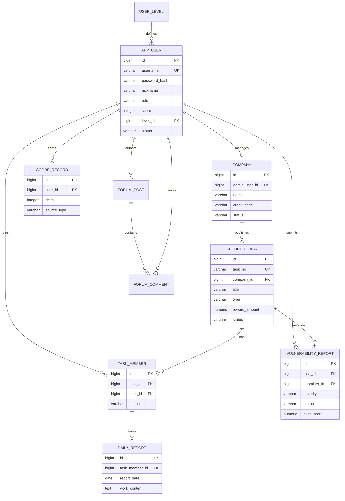

# Entity relationship model

```mermaid
erDiagram
  APP_USER ||--o| COMPANY : manages
  APP_USER ||--o{ TASK_MEMBER : joins
  SECURITY_TASK ||--o{ TASK_MEMBER : has
  COMPANY ||--o{ SECURITY_TASK : publishes
  TASK_MEMBER ||--o{ DAILY_REPORT : writes
  APP_USER ||--o{ VULNERABILITY_REPORT : submits
  SECURITY_TASK ||--o{ VULNERABILITY_REPORT : receives
  APP_USER ||--o{ SCORE_RECORD : earns
  USER_LEVEL ||--o{ APP_USER : defines
  APP_USER ||--o{ FORUM_POST : authors
  FORUM_POST ||--o{ FORUM_COMMENT : contains
  APP_USER ||--o{ FORUM_COMMENT : writes

  APP_USER {
    bigint id PK
    varchar username UK
    varchar password_hash
    varchar nickname
    varchar role
    integer score
    bigint level_id FK
    varchar status
  }
  COMPANY {
    bigint id PK
    bigint admin_user_id FK
    varchar name
    varchar credit_code
    varchar status
  }
  SECURITY_TASK {
    bigint id PK
    varchar task_no UK
    bigint company_id FK
    varchar title
    varchar type
    numeric reward_amount
    varchar status
  }
  TASK_MEMBER {
    bigint id PK
    bigint task_id FK
    bigint user_id FK
    varchar status
  }
  DAILY_REPORT {
    bigint id PK
    bigint task_member_id FK
    date report_date
    text work_content
  }
  VULNERABILITY_REPORT {
    bigint id PK
    bigint task_id FK
    bigint submitter_id FK
    varchar severity
    varchar status
    numeric cvss_score
  }
  SCORE_RECORD {
    bigint id PK
    bigint user_id FK
    integer delta
    varchar source_type
  }
```

